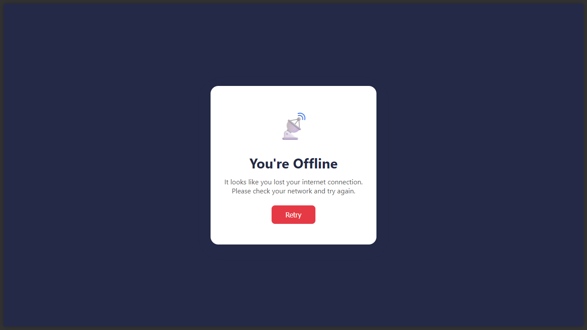

<h1 align="center">PHP-PWA</h1>
<p align="center"><em>Effortlessly Enable Seamless, Offline-Ready Web Experiences</em></p>

<p align="center">
    
    
    
</p>

---

## ✨ Overview

**PHP-PWA** is a lightweight library that enables your native PHP applications to become Progressive Web Apps (PWAs) without requiring any additional PHP or JavaScript frameworks. With PHP-PWA, your web app can work offline, load faster, and feel like a native application—all with simple integration into your existing PHP codebase.

---

## 🚀 Features

- ⚡ Instant offline support via Service Worker
- 🔄 Automatic generation of PWA manifest file (`manifest.json`)
- 🧩 Easy integration with native PHP applications (no framework required)
- 📦 Composer-friendly package structure
- 🛡️ No dependency on any PHP framework

---

## 🛠️ Technology Stack

Built with:


---

## 📦 Installation

Install via Composer:

```bash
composer require zmrq/php-pwa
```

---

## ⚙️ Usage

1. **Enable PWA in your application's root:**
    ```php
    <?php
        use Zmrq\PWA\Pwa;

        // The 'dir' parameter is the public root directory for PWA assets, default is 'pwa'.
        Pwa::enable(dir: 'pwa');

        // This returns an instance of the manifest class, allowing you to configure the manifest.
        $manifest = Pwa::enable(dir: 'pwa')
                        ->name('PHP PWA')
                        ->shortName('PWA')
                        ->startUrl('/');
    ?>
    ```

2. **Add the following script to your HTML `<head>`:**
    ```php
        <?= Pwa::renderMetaTags()
    ```

3. **Add the following script before the closing `</body>` tag:**
    ```php

        <?= Pwa::renderServiceWorker() ?>
    ```

---

## 📁 Example Directory Structure

```
/public
    /pwa
        ├── logo.png
        ├── offline.html
        ├── manifest.json
        └── sw.js
    ├── index.php
```
---

## 🖼️ Offline Page Preview

Below is a preview of the offline page as shown by `offline.png`:



---

## 🤝 Contributing

Contributions are welcome! Please fork this repository and submit a pull request.

---

## 📄 License

Licensed under the [MIT License](LICENSE).

---
